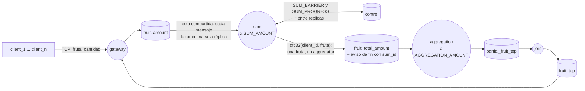

# Informe de Coordinación

## Resumen

El sistema implementa un pipeline distribuido tipo MapReduce que calcula el top de frutas por cantidad. Atiende a varios clientes al mismo tiempo y permite varias instancias de Sum y de Aggregation.

Los círculos son procesos (los que dicen ×N tienen varias réplicas) y los cilindros son colas o exchanges de RabbitMQ, rotulados con lo que viaja por ellos. Todos los mensajes internos llevan el `client_id`.

La cantidad de instancias se define con `SUM_AMOUNT` y `AGGREGATION_AMOUNT`, y el tamaño del top con `TOP_SIZE`. El protocolo externo entre Client y Gateway no cambió.

## Qué hace cada componente

| Componente | Estado que guarda | Qué hace al terminar un cliente |
|---|---|---|
| Gateway | Una conexión TCP por cliente | Devuelve el top final al cliente que corresponde |
| Sum | Suma por fruta y por `client_id`, más la barrera de ese cliente | Reparte lo acumulado entre los Aggregators |
| Aggregation | Suma por fruta y por `client_id`, más los Sum que ya avisaron | Calcula su top parcial y lo manda al Join |
| Join | Tops parciales por `client_id` | Une los parciales, recorta a `TOP_SIZE` y responde al Gateway |

## Coordinación

### Aislamiento por cliente

El Gateway genera un `client_id` (`uuid4`) por conexión y lo agrega a todos los mensajes internos. Sum, Aggregation y Join guardan un estado distinto por `client_id`, así que dos clientes en paralelo nunca mezclan datos.

### Cierre en Sum

Los datos llegan por una cola compartida, entonces RabbitMQ los reparte entre las instancias y el EOF lo recibe una sola. El EOF trae el `total_count`, que es la cantidad de mensajes de datos que el Gateway le reenvió a ese cliente: el Gateway lo cuenta en el handler de cada conexión. La instancia que recibe el EOF no puede deducirlo sola, porque no vio los datos que procesaron las otras. Lo publica como `SUM_BARRIER` en un exchange de control. Cada instancia publica además un `SUM_PROGRESS` con la cantidad que procesó, y todas leen todos los reportes. Cuando la suma de los reportes llega a `total_count`, cada instancia hace su flush. El orden en que lleguen los mensajes no importa.

Dentro de cada instancia, datos y control se consumen desde un solo canal y un solo hilo, por eso no hay locks.

#### Reportes de progreso

Si cada Sum reportara su progreso por cada mensaje, el tráfico de control sería proporcional al volumen de datos multiplicado por `SUM_AMOUNT`, y no escalaría. Por eso reporta una vez cada `PROGRESS_REPORT_EVERY` mensajes (K), desde que conoce el `total_count` del cliente.

Los reportes son cantidades acumuladas, así que saltear los intermedios no cambia el resultado. Lo que sí es importante cubrir es el último tramo: una réplica no sabe cuál es su último mensaje, y si le quedaran menos de K sin reportar la barrera nunca cerraría. Por eso un temporizador (`PROGRESS_FLUSH_DELAY`) reporta lo pendiente cuando pasa un rato sin datos nuevos.

### Partición de Sum a Aggregation

Cada fruta va a un único Aggregator: `crc32(f"{client_id}|{fruit}") % AGGREGATION_AMOUNT`. Se necesita una función determinista entre procesos, para que todas las instancias de Sum manden una misma fruta al mismo Aggregator sin comunicarse. `hash()` no sirve, porque su seed cambia en cada proceso. Tampoco hace falta un hash criptográfico: no hay un adversario ni requisitos de resistencia a colisiones, solo un reparto estable y razonablemente parejo. `crc32` (módulo `zlib`) lo da con menos costo. Un reparto desparejo afectaría el rendimiento, pero no el resultado.

### Cierre en Aggregation y Join

Al hacer flush, cada Sum avisa a todos los Aggregators con su `sum_id`, tenga o no frutas para ellos. Cada Aggregator espera `SUM_AMOUNT` avisos distintos, calcula su top parcial y lo manda al Join. Como una fruta vive en un solo Aggregator, el Join no tiene que sumar nada: cuando recibe `AGGREGATION_AMOUNT` parciales distintos los ordena, se queda con los primeros `TOP_SIZE` y responde al Gateway.

Las dos etapas usan la misma barrera (`ReplicaBarrier` en `common/barrier/barrier.py`). Para cada cliente guarda los ids de las réplicas que ya avisaron, y se completa cuando avisaron todas. Si un aviso llega repetido, no cuenta dos veces.

### Cierre con SIGTERM

Sum, Aggregation y Join dejan de consumir y cierran sus conexiones con RabbitMQ antes de salir. Si un `close` falla, igual se intenta cerrar el resto.

## Cambios al middleware

Respecto del middleware del TP2 agregué/modifiqué lo siguiente:

- **`channel=` en los constructores y propiedad `channel`:** permite que un middleware reutilice el canal de otro en lugar de abrir una conexión nueva. Sum lo usa para que la cola de datos y el exchange de control vivan en el mismo canal.
- **`register_consumer`:** registra el consumo de una cola o exchange sin bloquear. `start_consuming` sigue existiendo y ahora equivale a `register_consumer` más `pump_forever`.
- **`pump_forever`:** bloquea despachando los mensajes de todos los consumidores registrados en el canal. Con un canal compartido, un solo `pump_forever` atiende datos y control desde un único hilo, y por eso no hacen falta locks.
- **`call_later(delay, callback)`:** ejecuta `callback` dentro del hilo que consume, tras `delay` segundos. Sum lo usa para el temporizador de reportes de progreso. Solo lo puede usar el middleware que creó la conexión, porque es el que la tiene; si no, lanza `MessageMiddlewareMessageError`.
- **Exchange `direct` en lugar de `topic`:** las routing keys de control (`sum_ctrl_<id>`) y de Aggregation (`aggregation_<id>`) son exactas, así que no se necesitan patrones.
- **`close` con canal compartido:** no cierra la conexión si no es la dueña, para no cortarle el canal al otro middleware.

> [!NOTE]  
> **Alternativa descartada**
> 
> En una versión anterior que implementé, Sum consumía el exchange de control en un hilo aparte. Como pika no es thread-safe, para frenar ese consumo desde el hilo principal (por ejemplo ante un SIGTERM) agregué `request_stop` al middleware, que usa `add_callback_threadsafe` para ejecutar `stop_consuming` en el hilo dueño de la conexión. Funcionaba, pero obligaba a sincronizar el estado compartido entre dos hilos. Pasé datos y control a un único canal y un único hilo, por lo que `request_stop` quedó sin uso, así que la eliminé.

## Escalabilidad

| Dimensión | Mecanismo |
|---|---|
| Clientes simultáneos | `client_id` por conexión |
| Volumen de un cliente | Cola compartida repartida entre las `SUM_AMOUNT` instancias |
| Instancias de Sum y Aggregation | Se configuran con `SUM_AMOUNT` y `AGGREGATION_AMOUNT`; las barreras coordinan el cierre |
| Tráfico de control | Un reporte cada `PROGRESS_REPORT_EVERY` mensajes en lugar de uno por mensaje |
| Tamaño del top | `TOP_SIZE` |

## Correctitud

Dos invariantes sostienen el resultado:

1. Ningún Sum hace flush antes de que se hayan procesado los `total_count` mensajes del cliente, así que no se pierden datos.
2. Una fruta de un cliente se acumula en un solo Aggregator, así que ninguna cantidad se cuenta dos veces ni queda repartida.

## Supuestos

- Hay `SUM_AMOUNT` instancias de Sum y `AGGREGATION_AMOUNT` de Aggregation desde el arranque. El sistema escala, pero no es elástico.
